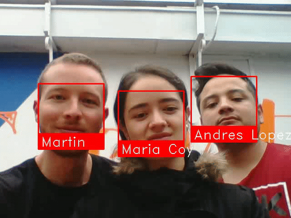

# checkingFace

CheckingFace does the verification of the identity to allow or refuses the access of the people linked to a specific place.

The propose is to give access to people who are previously registered in the DataBase CheckingFace, was done using PostgreSQL, and identity verification for people, main library used was face_recognition, who wants to enter a building, our database will be local, and just are taking into account the software solution. 



## Bulding the Enviroment

First, make sure you have dlib already installed with Python bindings.

Install this module from pypi using `pip3`:

```
$ pip3 install face_recognition
```

Install the opencv, to transmit in live video:

``` 	
$ sudo apt install python3-opencv
```

## API - Database Engine Storage

The API was made in ruby on rails with authentication JWT and it has the function of manage the registers of the users. The API interact with the DataBase, coded in PostgreSQL. 

The endpoints are:

1. Private route: https://api-jwt-v3.herokuapp.com/api/users:
```
Method: POST
Porpose: create a new user  
```

2. Private Route: https://api-jwt-v3.herokuapp.com/api/users/login:
```
Method: POST
Porpose: loging in a user with password and email
Returns a JWT token to retrieve the user info in JSON
```

3. Private Route: https://api-jwt-v3.herokuapp.com/api/user:
```
Method: GET
Porpose: show a user, you must send in Authorization Header a Bearer token
```

4. Private Route: https://api-jwt-v3.herokuapp.com/api/user:
```
Method: PATCH or PUT
Porpose: to change a user or updatings. You must send in Authorization Header a Bearer token
```

5. Public Route: https://api-jwt-v3.herokuapp.com/api/all:
```
Method: GET
Porpose: returns all users in database.
```

6. Route to uploading the picture of each profile: https://api-jwt-v3.herokuapp.com/
```
https://api-jwt-v3.herokuapp.com/
With the email already registed select the picture and send it to the database
```

## Face Recognition Model

The face_recognition model recognize and manipulate faces from Python or from the command line with the world's simplest face recognition library. This also provides a simple `face_recognition` command line tool that lets you do face recognition on a folder of images from the command line!

The Face Model is organized as two models:

1. Python-pic-recognition: 
```
In the python picture recognition directory there are 3 features: 
    a. Finding faces
    b. Identifing faces
    c. Pulling faces based on a group of people image. 
```

2. Python-vid-recognition:
```
In the python video recognition directory there are 3 features:
    a. live recognition: need to be execute in the console
    b. streaming directory: streaming video feature using the router config
    c. web directory: to face recognized thought the web (localhost IP)
```

### Features

### Find faces in pictures
---------------------------

Find all the faces that appear in a picture:

```
import face_recognition
image = face_recognition.load_image_file("your_file.jpg")
face_locations = face_recognition.face_locations(image)
```

#### Find and manipulate facial features in pictures

Get the locations and outlines of each person's eyes, nose, mouth and chin.

```
import face_recognition
image = face_recognition.load_image_file("your_file.jpg")
face_landmarks_list = face_recognition.face_landmarks(image)
```

#### Identify faces in pictures

Recognize who appears in each photo.

```
import face_recognition
known_image = face_recognition.load_image_file("biden.jpg")
unknown_image = face_recognition.load_image_file("unknown.jpg")

biden_encoding = face_recognition.face_encodings(known_image)[0]
unknown_encoding = face_recognition.face_encodings(unknown_image)[0]

results = face_recognition.compare_faces([biden_encoding], unknown_encoding)
```

### Finding face in REAL-TIME
-----------------------------

This feature has the ability to automatically recognize, thought the camera of the PC in the web browser, human faces based on dynamic facial images. This feature could be a security implemented and included in the access control to secure environments, identification of individuals at a particular place and intruder detection. This project proposes a real-time system for surveillance using cameras. The process is broken into two steps: (1) face detection and (2) face recognition to identify a registered people. For the first step, the system tracks and selects the faces with a label and name of the detected people. An efficient recognition algorithm is then used to recognize detected faces with a known database.

You can even use this library with other Python libraries to do real-time face recognition:

#### Requirements

-   Python 3.3+
-   Flask
-   OpenCV CV2
-   macOS or Linux (Windows not officially supported, but might work)

#### Command-Line Interface

When you install `face_recognition`, you get two simple command-line programs:

-   `face_recognition` - Recognize faces in a photograph or folder full for photographs.
-   `face_detection` - Find faces in a photograph or folder full for photographs.

##### `face_recognition` command line tool

The `face_recognition` command lets you recognize faces in a photograph or folder full for photographs.

First, you need to provide a folder with one picture of each person you already know. There should be one image file for each person with the files named according to who is in the picture:

Next, you need a second folder with the files you want to identify.

Then in you simply run the command `face_recognition`, passing in the folder of known people and the folder (or single image) with unknown people and it tells you who is in each image:

```
$ face_recognition ./pictures_of_people_i_know/ ./unknown_pictures/
```

There's one line in the output for each face. The data is comma-separated with the filename and the name of the person found.

An `unknown_person` is a face in the image that didn't match anyone in your folder of known people.

##### `face_detection` command line tool

The `face_detection` command lets you find the location (pixel coordinatates) of any faces in an image.

Just run the command `face_detection`, passing in a folder of images to check (or a single image):

```
$ face_detection  ./folder_with_pictures/

examples/image1.jpg,65,215,169,112
examples/image2.jpg,62,394,211,244
examples/image2.jpg,95,941,244,792
```

It prints one line for each face that was detected. The coordinates reported are the top, right, bottom and left coordinates of the face (in pixels).

#### WEB real-time Face Recognition:

After to install all the progams neaded, to get started with the WEB real-time Face Recognition, it is necesary to go to the web directory:

```
$ checkingFace/python-vid-recognition/web/
```
Once there, run the main.py file, which is an app build in Flask:
```
$ python3 main.py
```
As soons as, the main.py file is runed, make sure the port active, go directly to the browser and type the localhost IP using the port active, for example: 
```
localhost:5000
```


Authors
-------

-   **Martin Peña** - [andres-martin] (<https://github.com/andres-martin>)
-   **Andres Lopez** - [klupzor] (<https://github.com/klupzor>)
-   **Maria Alejandra Coy** - [macoyulloa] (<https://github.com/macoyulloa>)